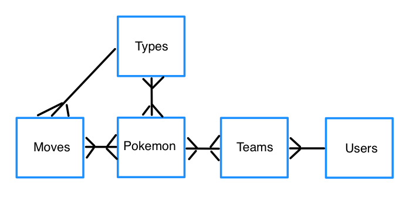

I've recently become re-obsessed with Pokemon and have been playing Pokemon Ultra Moon. I know, I know, I'm a little behind the times. Anyway, one of the central pieces to my playing strategy is figuring out the **best** final team. To do so, I first watched way too many YouTube videos. Then, I used a number of Pokemon team builder websites out there to double check the strengths and weaknesses of my final team. Using these team builder websites can really be hit or miss. Some are confusing, some don't have all the features I want, and some don't seem to be maintained anymore.

So, I had the idea that I could build my own. A lofty goal, but it seems like a fun side project. So my first step is figuring out how I'd like the PostgreSQL database to be laid out. It can be a bit of a doozy, as Pokemon data can be inherently complex, [as others have described before me](http://www.pocketjavascript.com/blog/2015/11/23/introducing-pokedex-org). This post is my initial rough draft of the database schema. To track progress and to suggest features / improvements, feel free to check out the [GitHub repo](https://github.com/njosefbeck/poketeambuilder.com).

## Entities

When figuring out how to lay out a database's tables, I first like to start with the core data entities. These are entities who will ultimately have their own tables. For my Pokemon team building app at this stage, the entities are:

* Pokemon
* Types
* Moves
* Users
* Teams

Some additional entities that I'm considering to add as well would be: Generations, Games, and Pokemon Categories (to handle things like legendary pokemon).

The schemas for these entities are as follows:

```
pokemon
-------
id
name
sprite_url
pokedex_url

types
-----
id
name

moves
-----
id
name
type_id

users
-----
id
firstName
lastName
email
password

teams
-----
id
user_id
share_url
likes

```

From the above schemas, you can see a couple of relationships already starting to form (for example, each move has a specific type, represented by the foreign key of `type_id`). Let's talk about data relationships now!

## Entity Relationships

Below you'll find a rough Entity Relationship Diagram (ERD) describing how each entity is related to another. For example, you can see that the **Moves** entity has a one-to-many relationship with **Types**. That is, a move can have ONE type and a single type can be assigned to MANY moves. Most of the data relationships for this app can be described as many-to-many. For example, a **Pokemon** can have many **Types** (two, in fact) and a **Type** can be assigned to many different **Pokemon**. The diagram below depicts this. The "crows feet" represent a many relationship, and the lack of crows feet indicates a singular relationship.



To handle relationships that are one-to-many, all we have to do is add a foreign key to the appropriate table to denote the relationship. You've already seen this above with two of the entity schemas.

```
moves
-----
id
name
type_id

teams
-----
id
user_id
share_url
likes
```

By including `type_id` on a move, and `user_id` on a team, we're indicating that there is a one-to-many relationship between the data. It would be inappropriate in this case to put a `team_id` on a **User** entity as one user can have multiple teams.

For the remaining many-to-many relationships shown in the ERD above, we need to create additional **cross-reference** or **linking** tables (as an aside, is there an official name for this kind of table?). Those tables and their schemas are described below.

```
type_relations
--------------
atk_type_id
def_type_id
modifier

pokemon_moves
-------------
pokemon_id
move_id

pokemon_types
-------------
pokemon_id
type_id

pokemon_teams
-------------
pokemon_id
team_id
```

Most of these schemas just consist of two foreign keys representing two entities. I use the convention of entity1_entity2 in my naming, but I've also seen entity1_to_entity2 as an alternative. How do you go about naming these kinds of linking tables?

## Next Steps

So, that's the schema for my pokemon team builder app. There are a number of additional entities I am also considering adding, to add to the richness of data being gathered and to enhance the filtering that will ultimately be possible in the app. Up next though, I'd like to decide on the data types for each table column and then determine how to load all the data into the database.

Have comments? Suggestions? Please don't hesitate to comment. Interested in this project and want to make sure it has the features you want? Head on over to GitHub and let me know in the [Issues](https://github.com/njosefbeck/poketeambuilder.com/issues).
