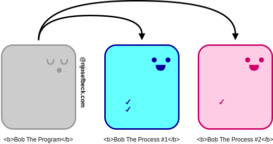
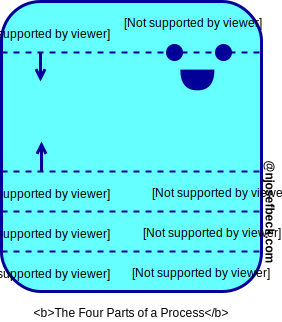
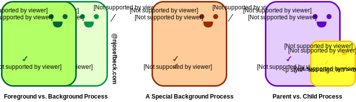
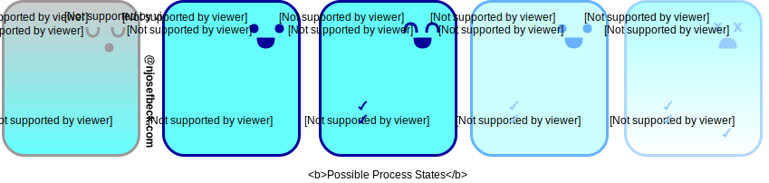
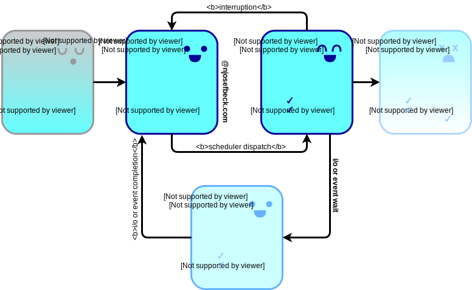

Before talking about a process, first we must define what a **program** is. In short, a program is a _passive_ collection of instructions for the server to run.

A **process** is the _active_ execution of those instructions. The basic flow is:

```go
write code (program) 
  > computer compiles it to binary 
    > run the binary (process)
```

A single program can be run multiple times at the same time, thus creating multiple processes.

Processes are represented by process identifiers (PID), a unique numeric value. (These numeric values can be recycled, so two processes could have the same PID, just not at the same time.)

Processes can be short or long-lived.



## Parts of a process

When a program becomes a process, the running process can be divided into four parts:



- **Stack**: contains the temporary data, like method/function parameters, return addresses, local variables
- **Heap**: dynamically allocated memory to a process during runtime
- **Data**: global and static variables
- **Text**: compiled program code

## Types of processes



**Foreground**: A foreground process is initialized and controlled through a terminal session. A user starts these, not the system.

**Background**: Not connected to a terminal and doesn't expect any user input. A **daemon** is a type of background process that starts at system startup and continues to run forever as a service.

Processes can also be divided into **Parent** and **Child** processes. Child processes are created by a parent process at runtime.

## Process states



Processes can have a number of possible states. The names for these states vary by operating system, but the following five are pretty standard.

- **New**: process is being created
- **Ready**: process has all resources available that it needs to run, but CPU is not currently working on this process's instructions
- **Running**: CPU is working on this process's instructions
- **Waiting**: process can't run at the moment because it's waiting for some resource to become available or an event to occur (keyboard input, disk access request, a child process to finish)
- **Terminated**: process has completed




